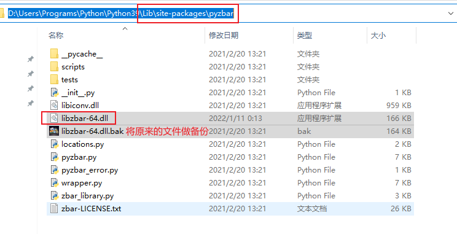

### 此文件可替换windows平台python三方库pyzbar的包目录下对应的dll文件，解决中文二维码识别乱码问题

### 64位Windows系统适用， 32位的版本在 [这里](../../Release/libzbar-32.dll)，可自行下载替换

## 使用方法

+ 安装pyzbar

  ```powershell
  python -m pip install pyzbar
  ```

+ 替换pyzbar本地文件夹下的libzbar-64.dll文件



